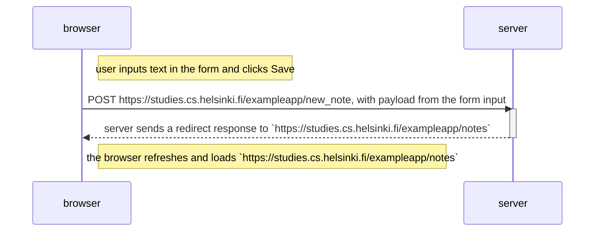

```mermaid
sequenceDiagram
  participant browser
  participant server

  Note right of browser: user inputs text in the form and clicks Save
  browser->>server: POST https://studies.cs.helsinki.fi/exampleapp/new_note, with payload from the form input

  activate server
  server-->>browser: server sends a redirect response to `https://studies.cs.helsinki.fi/exampleapp/notes`
  deactivate server

  Note right of browser: the browser refreshes and loads `https://studies.cs.helsinki.fi/exampleapp/notes`
```
