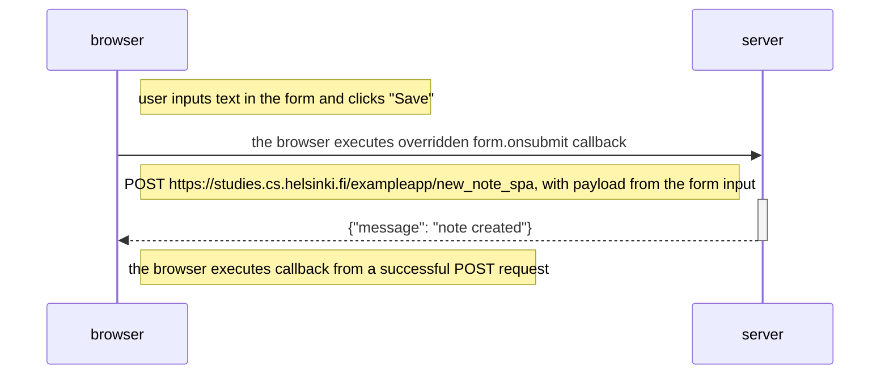

```mermaid
sequenceDiagram
  participant browser
  participant server

  Note right of browser: user inputs text in the form and clicks "Save"
  browser->>server: the browser executes overridden form.onsubmit callback
  Note right of browser: POST https://studies.cs.helsinki.fi/exampleapp/new_note_spa, with payload from the form input

  activate server
  server-->>browser: {"message": "note created"}
  deactivate server

  Note right of browser: the browser executes callback from a successful POST request
```
